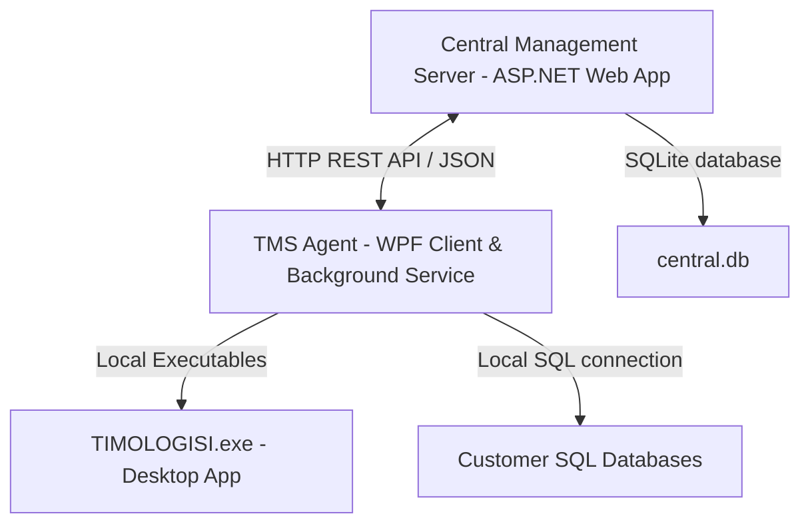

# Οδηγός Έργου & Βήματα Λειτουργίας (TMS Agent Handbook)

Αυτό το έγγραφο αποτελεί τον επίσημο τεχνικό οδηγό («μπούσουλα») του έργου **TMS Agent**. Περιγράφει την αρχιτεκτονική του συστήματος, τη δομή του κώδικα, τις βασικές ροές λειτουργίας και τις αυστηρές διαδικασίες που πρέπει να ακολουθούνται κατά την ανάπτυξη και τη δημοσίευση νέων εκδόσεων, ώστε να διασφαλίζεται η σταθερότητα και να αποφεύγονται παλινδρομήσεις (regressions).

---

## 1. Αρχιτεκτονική & Δομή του Έργου

Το σύστημα TMS Agent ακολουθεί μια αρχιτεκτικονική **Server-Client** με τα εξής βασικά μέρη:



### Δομή Φακέλων (Directory Structure)
* **`Tms.CentralManagement` (Server):** 
  * Διαδικτυακή εφαρμογή ASP.NET Core (Razor Pages + Web API) για τη διαχείριση των Clients, των εκδόσεων (Versions) και των ανακοινώσεων (Broadcasts).
  * Χρησιμοποιεί τοπική βάση **SQLite (`central.db`)** για αποθήκευση.
  * Φιλοξενεί τα πακέτα αναβαθμίσεων `.zip` στον φάκελο `wwwroot/packages/`.
* **`Tms.Agent.Wpf` (Client UI & Service):**
  * Διπλής λειτουργίας εφαρμογή (υβριδική):
    * **WPF Panel UI:** Η διεπαφή χρήστη που εμφανίζεται στο System Tray και επιτρέπει χειροκίνητους ελέγχους, εισαγωγή κωδικών και ρυθμίσεις.
    * **Windows Service (`TmsAgentService.cs`):** Εκτελείται στο παρασκήνιο (Session 0) για αυτόματο συγχρονισμό ρυθμίσεων και έλεγχο ενημερώσεων ανά τακτά χρονικά διαστήματα (κάθε 2 λεπτά).
* **`Tms.Agent.Core` (Business Logic Library):**
  * Περιλαμβάνει τον **Update Engine (`UpdateEngine.cs`)** που αναλαμβάνει όλη τη «βαριά» δουλειά: λήψη πακέτων, αποσυμπίεση, εκτέλεση SQL scripts, ανίχνευση εκτελέσιμων και διακοπή διεργασιών.
* **`Tms.Shared`:**
  * Κοινά DTOs, Models και βοηθητικές κλάσεις για την επικοινωνία μεταξύ Server και Client.
* **`PublishAndSetup`:**
  * Φάκελος εξόδου για τις εκδόσεις παραγωγής (Production builds, Server packages, Setup binaries).

---

## 2. Βασικές Ροές Λειτουργίας (Operational Flows)

### Α. Ροή Ελέγχου & Λήψης Αναβαθμίσεων (Check for Updates)
1. Ο Agent (είτε η υπηρεσία Service είτε η εφαρμογή WPF) στέλνει αίτημα `POST` στο API του Server (`/api/updates/check`) στέλνοντας το δικό του API Key, το Machine Name και τη λίστα με τα τοπικά εταιρικά προφίλ (ConnectionString, Τρέχουσα Έκδοση, κ.λπ.).
2. Ο Server συγκρίνει τις εκδόσεις των προφίλ με τις διαθέσιμες εκδόσεις στη βάση δεδομένων του.
3. **Υπολογισμός Έγκρισης (IsAuthorizedByAdmin):**
   * Αν η βάση δεδομένων έχει ήδη ενημερωθεί επιτυχώς (ισχύει για Clients/Operators), η έγκριση δίνεται αυτόματα.
   * Αν ο διαχειριστής έχει πατήσει «Έγκριση Admin» στην κονσόλα για το συγκεκριμένο προφίλ, η έγκριση δίνεται αυτόματα.
   * Αν δεν ισχύει τίποτα από τα δύο, ο Agent απαιτεί την πληκτρολόγηση του κωδικού ασφαλείας (Admin Passcode) τοπικά.
4. Αν υπάρχει νέα έκδοση, ο Agent εμφανίζει την ειδοποίηση και ο χρήστης εκτελεί την αναβάθμιση.

### Β. Ροή Αναβάθμισης Βάσης Δεδομένων & Εκτέλεσης SQL Scripts
1. Κατά την έναρξη της αναβάθμισης ενός προφίλ, ο Agent κατεβάζει τα SQL scripts που εκκρεμούν για τη συγκεκριμένη βάση δεδομένων.
2. Διαβάζει τον πίνακα ιστορικού της βάσης του πελάτη `[dbo].[SQL_HISTORY_UPDATE_SCRIPTS]` για να βρει το τελευταίο εκτελεσμένο block (π.χ. `2331`).
3. Αναλύει τα αρχεία SQL (τα οποία περιέχουν σενάρια χωρισμένα με ειδικά σχόλια block, π.χ. `--NEW SCRIPT [number]`).
4. Εκτελεί ένα-ένα τα blocks που έχουν μεγαλύτερο αριθμό (π.χ. `2332`, `2333` κ.λπ.) μέσα σε SQL Transaction.
5. Μετά την επιτυχή εκτέλεση κάθε block, ενημερώνει τον πίνακα ιστορικού της βάσης.

### Γ. Ροή Αναβάθμισης Αρχείων Εφαρμογής & Διακοπής Διεργασιών
1. **Διακοπή Διεργασιών:** Πριν την αντικατάσταση των αρχείων, ο Agent ψάχνει τις ενεργές διεργασίες της εφαρμογής (π.χ. `TIMOLOGISI.exe`) χρησιμοποιώντας τη μέθοδο `FindActiveProductiveExe`.
2. Εκτελεί **`Process.Kill()` σε όλες τις ανοιχτές διεργασίες της εφαρμογής** (καλύπτει την περίπτωση που ο χρήστης την έχει ανοιχτή παραπάνω από μία φορές) για να ξεκλειδωθούν τα αρχεία.
3. Κατεβάζει το αρχείο `.zip` της έκδοσης από τον Server και το αποσυμπιέζει σε προσωρινό φάκελο (`temp`).
4. Αντικαθιστά τα αρχεία στον φάκελο εγκατάστασης της εφαρμογής (π.χ. `C:\Program Files\PRAKTOREIA`).
5. Γράφει τη νέα έκδοση στο τοπικό αρχείο **`tms_version.txt`** μέσα στον φάκελο της εφαρμογής.

### Δ. Αυτόματη Αναβάθμιση του Ίδιου του Agent (Self-Upgrade)
1. Όταν ανιχνεύεται νέα έκδοση συστήματος (System Version, π.χ. `1.5.60`), ο Agent κατεβάζει το zip του συστήματος.
2. Αν ο Agent εκτελείται στο Tray (υπάρχει login χρήστη), εμφανίζει ειδοποιήσεις Balloon Tips στο System Tray (κατά την έναρξη λήψης, ανά 25% προόδου λήψης και κατά την επιτυχή ολοκλήρωση).
3. Στην ολοκλήρωση, εμφανίζει ειδοποίηση επανεκκίνησης και πραγματοποιεί αναμονή 2 δευτερολέπτων (`Thread.Sleep(2000)`) ώστε ο χρήστης να προλάβει να διαβάσει το Balloon Tip, και στη συνέχεια τερματίζει την WPF εφαρμογή (`Shutdown`) για να ξεκινήσει η εγκατάσταση.
4. Δημιουργεί ένα δυναμικό αρχείο δέσμης ενεργειών **`.bat`** στον προσωρινό φάκελο των Windows.
5. Το αρχείο `.bat` εκτελείται με δικαιώματα Administrator (`runas` UAC):
   * Σταματάει την υπηρεσία `TmsAgent` (αν τρέχει) με όριο αναμονής (timeout) 10 δευτερολέπτων για να αποφευχθεί ατέρμονο κόλλημα σε κατάσταση `STOP_PENDING`.
   * Περιμένει σε βρόχο (loop) έως 10 δευτερόλεπτα μέχρι να ξεκλειδωθεί το εκτελέσιμο `Tms.Agent.Wpf.exe` (μέχρι να κλείσει η τρέχουσα εφαρμογή).
   * Εκτελεί `taskkill /f /im Tms.Agent.Wpf.exe` και `taskkill /f /im TmsAgentService.exe` για να διασφαλίσει τον άμεσο τερματισμό όλων των διεργασιών.
   * Αντιγράφει τα νέα αρχεία στον φάκελο εγκατάστασης του Agent (`C:\Program Files (x86)\TmsAgent`) με έναν βρόχο retry έως 10 φορές. Σε κάθε αποτυχία της αντιγραφής (π.χ. λόγω κλειδωμένων DLLs), εκτελεί εκ νέου `taskkill` και περιμένει 2 δευτερόλεπτα πριν ξαναδοκιμάσει, αποτρέποντας έτσι ατέρμονες λούπες (deadlocks).
   * Εκκινεί ξανά την υπηρεσία ή την εφαρμογή Agent και διαγράφει τον εαυτό του.

### Ε. Ροή Αυτόματης Αναβάθμισης κατά την Εκκίνηση (Silent Auto-Upgrade on PC Startup)
Όταν ο υπολογιστής κάνει επανεκκίνηση, ο Agent εκκινεί αυτόματα (μέσω Task Scheduler) με την παράμετρο `--startup`.
1. **Παράκαμψη Διαλόγων:** Ο Agent εισέρχεται σε **Silent Mode** (`IsSilentMode = true`). Όλα τα παράθυρα διαλόγου (`MessageBox.Show`, `LoginWindow`, `WizardProgressWindow`) παρακάμπτονται πλήρως για να μην εμποδίζεται η ροή.
2. **Άμεσος Έλεγχος:** Αντί να περιμένει 2 λεπτά, ο Agent εκτελεί έλεγχο για αναβαθμίσεις **αμέσως** μόλις ξεκινήσει.
3. **Αναβάθμιση Agent:** Αν εκκρεμεί αναβάθμιση του ίδιου του Agent, ξεκινάει αυτόματα η λήψη και η εγκατάσταση της έκδοσης. Ο χρήστης ενημερώνεται με balloon tip στο Tray: `TMS Agent - Αναβάθμιση: Έναρξη λήψης αρχείων αναβάθμισης (v1.5.57)...`.
4. **Διαδοχική Αναβάθμιση Προφίλ (Sequentially):** Αν ο Agent είναι ήδη ενημερωμένος, ελέγχει τα εταιρικά προφίλ. Για κάθε εγκεκριμένο προφίλ (`IsAuthorizedByAdmin = true` και `IsWaitingForDb = false`), εκτελεί διαδοχικά (ένα προς ένα) την αναβάθμιση:
   * **Tray Balloon:** Εμφανίζει ειδοποίηση έναρξης `TMS Agent - Αναβάθμιση Εφαρμογής: Έναρξη αυτόματης αναβάθμισης για την εταιρεία: [CompanyName]...`
   * **Tray Balloon (Βάση):** Κατά την εκτέλεση SQL scripts, εμφανίζει ειδοποίηση: `TMS Agent - Βάση Δεδομένων: Εκτέλεση SQL scripts για την εταιρεία: [CompanyName]...`
   * **Tray Balloon (Αρχεία):** Κατά τη λήψη των εκτελέσιμων, εμφανίζει ειδοποίηση: `TMS Agent - Διάθεση Αρχείων: Λήψη νέων αρχείων της εφαρμογής για την εταιρεία: [CompanyName]...`
   * **Tray Balloon (Ολοκλήρωση):** Μόλις τελειώσει, εμφανίζει: `TMS Agent - Επιτυχία: Η αναβάθμιση της εταιρείας [CompanyName] ολοκληρώθηκε με επιτυχία!`

### Στ. Διαδικασίες & Τρόποι Αναβάθμισης (Upgrade Modes)
Οι αναβαθμίσεις στο σύστημα TMS Agent χωρίζονται σε δύο κατηγορίες με διαφορετική συμπεριφορά:

1. **Αναβαθμίσεις του Agent (System Versions / Tray Auto-Upgrade):**
   * Οι αναβαθμίσεις του ίδιου του Agent (System/Tray) εκτελούνται **πάντα αυτόματα και σιωπηλά** στο Tray.
   * Εκτελούνται είτε έχει κάνει login ο χρήστης είτε όχι, μέσω της υπηρεσίας παρασκηνίου (Windows Service) ή του Task Scheduler με υψηλά δικαιώματα διαχειριστή.
   * Κατά την έναρξη, αν ανιχνευθεί νεότερη έκδοση Agent, λαμβάνεται και εγκαθίσταται αυτόματα στο παρασκήνιο χωρίς να απαιτείται έγκριση ή ενέργεια από τον χρήστη.

2. **Αναβαθμίσεις των Εφαρμογών (TIMOLOGISI.exe / Client Profiles):**
   * Οι αναβαθμίσεις της εφαρμογής τιμολόγησης εκτελούνται με βάση τη ροή εγκρίσεων:
     * **Push (Άμεση Αναβάθμιση) από την Κονσόλα:** Αν ο διαχειριστής στείλει Push, η αναβάθμιση εκτελείται αυτόματα στο παρασκήνιο (αν το πρόγραμμα είναι κλειστό).
     * **Συγχρονισμός Admins:** Μόλις ο πρώτος Admin αναβαθμίσει τη βάση, οι υπόλοιποι Admins λαμβάνουν αυτόματα την έγκριση και αναβαθμίζονται αθόρυβα (χωρίς επανεκτέλεση SQL scripts).
     * **Ειδοποιήσεις & Αυτόματη Αναβάθμιση:**
       * **Αν το ERP εκτελείται:** Εμφανίζεται πλούσιο ειδοποιητικό παράθυρο (NotificationWindow) με κουμπιά **«Εκτέλεση»** (που ανοίγει τον Wizard) και **«Κλείσιμο»** (που κλείνει το παράθυρο και ξαναειδοποιεί σε 30 λεπτά).
       * **Αν το ERP είναι κλειστό:** Η αναβάθμιση εκτελείται αυτόματα και σιωπηλά στο παρασκήνιο.

   * **Αναλυτικά Βήματα Αναβάθμισης ανά Ρόλο Χρήστη (Admin & Operator Flows):**

     * **Α. Ροή Αναβάθμισης από Διαχειριστή (Admin):**
        1. **Ειδοποίηση**: Εμφανίζεται το Balloon Tip στο Tray που ειδοποιεί ότι υπάρχει διαθέσιμη αναβάθμιση εφαρμογής. Αν ο χρήστης το κλείσει, θα του το υπενθυμίζει κάθε **30 λεπτά** μέχρι να συνδεθεί και να εκτελέσει την αναβάθμιση.
        2. **Login**: Ο χρήστης κάνει κλικ στο balloon ή ανοίγει το Panel και συνδέεται ως **Admin** (διαχειριστής).
        3. **Release Notes**: Ο Admin βλέπει στην οθόνη του Agent τις σημειώσεις έκδοσης (Release Notes) της νέας έκδοσης.
        4. **Έναρξη Εκτέλεσης**: Πατάει το κουμπί **«Εκτέλεση»** στο παράθυρο.
        5. **SQL Scripts**: Ο Agent τρέχει όλα τα απαιτούμενα SQL σενάρια αναβάθμισης στη βάση δεδομένων.
        6. **Διαγραφή TIMOLOGISI_OLD**: Διαγράφει τον προηγούμενο φάκελο backup `TIMOLOGISI_OLD` αν υπάρχει.
        7. **Backup σε TIMOLOGISI_OLD**: Μετονομάζει/μεταφέρει το τρέχον εκτελέσιμο `TIMOLOGISI.exe` (και τα σχετικά αρχεία) στο `TIMOLOGISI_OLD` για ασφάλεια.
        8. **Αντιγραφή Νέων Αρχείων**: Αποσυμπιέζει και αντιγράφει όλα τα νέα αρχεία από το `.zip` της έκδοσης στον φάκελο της εφαρμογής, και ολοκληρώνει την αναβάθμιση.

     * **Β. Ροή Αναβάθμισης από Χειριστή (Operator):**
       1. **Ειδοποίηση**: Εμφανίζεται το Balloon Tip στο Tray για διαθέσιμη αναβάθμιση. Αν ο χρήστης το κλείσει, θα του το υπενθυμίζει κάθε **30 λεπτά**.
       2. **Login**: Ο Operator κάνει κλικ στο balloon και συνδέεται ως **Operator** (χειριστής).
       3. **Έλεγχος Αναβάθμισης Admin**:
          * **Αν ο Admin ΔΕΝ έχει τρέξει ακόμα την αναβάθμιση**: Εμφανίζεται μήνυμα ότι η αναβάθμιση είναι «Σε αναμονή αναβάθμισης από τον Admin». Ο Operator δεν μπορεί να προχωρήσει μέχρι ο Admin να κάνει την αναβάθμιση πρώτος.
          * **Αν ο Admin ΕΧΕΙ ήδη τρέξει την αναβάθμιση**: Ο Operator βλέπει τις σημειώσεις έκδοσης και πατάει **«Εκτέλεση»**.
       4. **Αντιγραφή Αρχείων**: Ο Agent τερματίζει το τοπικό `TIMOLOGISI.exe`, κρατάει backup στο `TIMOLOGISI_OLD` και αντιγράφει τα νέα αρχεία στον τοπικό του φάκελο (χωρίς να εκτελέσει SQL scripts, αφού η βάση έχει ήδη ενημερωθεί από τον Admin).
       5. **Αυτόματη Αναβάθμιση στο Restart**: Αν ο Operator δεν εκτελέσει ποτέ την αναβάθμιση χειροκίνητα, αυτή θα εκτελεστεί αυτόματα και σιωπηλά (silent mode) κατά την εκκίνηση του υπολογιστή (PC Startup / IsSilentMode = true), εφόσον ο Admin έχει ήδη ολοκληρώσει την αναβάθμιση.

---

## 3. Διαδικασίες Δημοσίευσης & Αναβάθμισης (Deployment Steps)

Κάθε φορά που κάνουμε μια αλλαγή στον κώδικα και θέλουμε να τη δημοσιεύσουμε, **πρέπει αυστηρά** να ακολουθούμε τα παρακάτω βήματα με τη συγκεκριμένη σειρά:

### Βήμα 1: Αλλαγή Έκδοσης στον Κώδικα (Version Bump)
Αυξάνουμε την έκδοση (πάντα σε 3 επίπεδα, π.χ. από `1.5.56` σε `1.5.57`) στα εξής αρχεία του `Tms.Agent.Wpf`:
1. **App.xaml.cs:** Στη γραμμή που καλεί το `CheckForUpdatesAsync`.
2. **TmsAgentService.cs:** Στη γραμμή ελέγχου αναβάθμισης και σύγκρισης της έκδοσης.
3. **MainViewModel.cs:** Στην ιδιότητα `AppVersion`.

### Βήμα 2: Προσθήκη Seeding στη Βάση του Server
Στο αρχείο **Program.cs** του Server, προσθέτουμε ένα μπλοκ ελέγχου για τη νέα έκδοση:
* Ορίζουμε ρητά στην περιγραφή και στα Release Notes αν η αλλαγή αφορά τον **Server**, τον **Client** ή και τα δύο (**Server & Client**).
* *Παράδειγμα:*
```csharp
if (!context.Versions.Any(v => v.VersionNumber == "1.5.57"))
{
    // Απενεργοποίηση προηγούμενων
    ...
    // Προσθήκη νέας έκδοσης με BinaryFileUrl = "/packages/app_1.5.57.zip"
}
```

### Βήμα 3: Compile του Project
Εκτελούμε build σε Release mode για να βεβαιωθούμε ότι δεν υπάρχουν σφάλματα μεταγλώττισης:
```powershell
dotnet build -c Release
```
*(Αν ο τοπικός Server τρέχει στο παρασκήνιο, τον σταματάμε πρώτα για να μην κρατάει κλειδωμένα τα αρχεία `.exe`)*

### Βήμα 4: Πακετάρισμα & Δημοσίευση Αναβάθμισης (Publish Update)
Εκτελούμε το PowerShell σενάριο δημοσίευσης αναβάθμισης:
```powershell
.\publish-update.ps1 -Version 1.5.57 -ScopeChoice 3
```
* Αυτό θα κάνει publish τα εκτελέσιμα του Agent, θα δημιουργήσει το αρχείο `app_1.5.57.zip` και θα το αντιγράψει αυτόματα στους φακέλους `wwwroot/packages/` (Dev και Production).

### Βήμα 5: Πακετάρισμα του Setup (Publish Setup)
**ΠΡΟΣΟΧΗ:** Πρέπει πάντα να εκτελούμε και αυτό το βήμα ώστε οι νέες εγκαταστάσεις να παίρνουν απευθείας τη σωστή έκδοση!
```powershell
.\publish-agent-setup.ps1
```
* Αυτό θα ενημερώσει τους φακέλους `PublishAndSetup\AgentSetup` και `PublishAndSetup\Agent` με τα νέα εκτελέσιμα, έτοιμα για διανομή.

### Βήμα 6: Επανεκκίνηση του Server
Εκκινούμε τον Server ώστε να διαβάσει το νέο seeding του `Program.cs` και να καταχωρήσει τη νέα έκδοση στη βάση δεδομένων `central.db`:
```powershell
dotnet run -c Release --project Tms.CentralManagement --no-build
```

---

## 4. Κανόνες Ανάπτυξης & Αποφυγής Σφαλμάτων (Regression Prevention Rules)

Για να μην «χαλάνε» υπάρχουσες λειτουργίες κατά τις αναβαθμίσεις, πρέπει να τηρούνται αυστηρά οι εξής κανόνες:

1. **Τοπική Ανίχνευση Έκδοσης (Local Program Version Integrity):**
   * Ο Agent **ποτέ** δεν πρέπει να ενημερώνει το αρχείο `tms_version.txt` ή να αλλάζει την τοπική έκδοση της εφαρμογής μέσω του συγχρονισμού ρυθμίσεων (config commands).
   * Το `tms_version.txt` γράφεται **μόνο** κατά την πραγματική εξαγωγή (unzip) των αρχείων της εφαρμογής στον υπολογιστή.
   * Κάθε σταθμός εργασίας (workstation / Client-role Agent) ελέγχει την τοπική έκδοση της εφαρμογής αποκλειστικά από το δικό του αρχείο `tms_version.txt` (ή εναλλακτικά από την έκδοση του τοπικού EXE). Απαγορεύεται αυστηρά η λήψη ή η αντικατάσταση της τοπικής έκδοσης του προγράμματος (`CurrentProgramVersion` και `CurrentVersion`) από την έκδοση του Server κατά τον συγχρονισμό των ρυθμίσεων (`SyncConfigCommands`), καθώς αυτό θα έκανε τον Agent να πιστεύει εσφαλμένα ότι είναι ενημερωμένος χωρίς να έχει λάβει τα αρχεία.
2. **Μορφή Εκδόσεων (3-Level Versioning):**
   * Κάθε έκδοση συστήματος ή εφαρμογής πρέπει να ακολουθεί τη μορφή `X.Y.Z` (π.χ. `1.5.57`). Μορφές με 2 επίπεδα (π.χ. `1.5`) προκαλούν σφάλματα στην κλάση `Version` του .NET.
3. **Release Notes Format:**
   * Κάθε καταχώρηση έκδοσης πρέπει να ξεκινά ρητά αναφέροντας το scope: `Αφορά: Server`, `Αφορά: Client` ή `Αφορά: Server & Client`.
4. **Αποδέσμευση Διεργασιών (Process Locks):**
   * Πριν από οποιαδήποτε εξαγωγή αρχείων (είτε για την εφαρμογή είτε για τον ίδιο τον Agent), πρέπει να διασφαλίζεται ότι όλες οι σχετικές διεργασίες έχουν τερματιστεί επιτυχώς (`Process.Kill()`) και έχει ολοκληρωθεί ο έλεγχος ξεκλειδώματος του αρχείου.
5. **Silent Mode & Διαλογικά Παράθυρα (MessageBoxes):**
   * Όταν `IsSilentMode = true` (εκκίνηση με `--startup`), **απαγορεύεται** η χρήση οποιουδήποτε `MessageBox.Show` ή διαλογικού παραθύρου. Όλη η πρόοδος και τα σφάλματα πρέπει να αποστέλλονται μέσω Balloon Tips στο Tray, ώστε να μην διακόπτεται η αυτόματη διαδικασία αναβάθμισης.
6. **UAC Elevation:**
   * Η αντικατάσταση αρχείων στον φάκελο `Program Files (x86)` απαιτεί δικαιώματα Administrator. Η εκτέλεση του batch αρχείου αναβάθμισης του Agent πρέπει πάντα να γίνεται με `UseShellExecute = true` και `Verb = "runas"` όταν εκτελείται από το WPF Panel.
7. **Επιμονή Ειδοποιήσεων Ανακοινώσεων (Broadcast Persistence):**
   * Κάθε ανακοίνωση/νέα εμφανίζεται μία μόνο φορά ανά υπολογιστή. Όταν ο χρήστης πατήσει «Προβολή» ή «Κλείσιμο» (ή κλείσει το παράθυρο με το X), η ανακοίνωση καταγράφεται μόνιμα στο τοπικό αρχείο `seen_broadcasts.json` και δεν εμφανίζεται ποτέ ξανά, ούτε μετά από επανεκκίνηση του υπολογιστή ή του Agent.
8. **Κανόνες Client-Role Agents (No Direct DB Connections):**
   * Οι Agents με ρόλο `"Client"` **δεν επιτρέπεται** να συνδέονται απευθείας στη βάση δεδομένων SQL (skip local DB checks). Λαμβάνουν τις πληροφορίες της έκδοσης της βάσης απευθείας από τον Server κατά τον συγχρονισμό των `ConfigCommands`. Αυτό αποτρέπει timeouts και κολλήματα (stuck on "Έλεγχος...") όταν η θύρα SQL Server 1433 είναι κλειστή στους τερματικούς σταθμούς.
   * **Παράκαμψη Monitored DB Check:** Στους Client-role Agents παρακάμπτεται ο έλεγχος των Monitored Databases στο Panel. Έτσι, τα εταιρικά προφίλ δεν εμφανίζονται λανθασμένα ως «Δεν παρακολουθείται» (Not Monitored) επειδή η βάση δεδομένων φιλοξενείται σε άλλον υπολογιστή (Server) του δικτύου. Αυτό επιτρέπει στους τερματικούς σταθμούς να λαμβάνουν κανονικά τις αναβαθμίσεις των αρχείων της εφαρμογής.
   * **Λογική Κενών Πακέτων (Empty Binary URL):** Εάν μια έκδοση προγράμματος (Program Version) έχει κενό/null το πεδίο `BinaryFileUrl` (σημαίνει ότι περιέχει μόνο SQL scripts αναβάθμισης της βάσης), οι Client-role Agents θεωρούν αυτόματα το προφίλ ως «Ενημερωμένο». Δεν επιχειρείται λήψη αρχείων για τερματικούς σταθμούς (workstations), αφού αυτοί δεν εκτελούν SQL scripts και δεν υπάρχουν αρχεία εφαρμογής προς αναβάθμιση. Μόνο οι Server-role Agents θα εκτελέσουν την αναβάθμιση της βάσης.
9. **Μοναδικότητα API Key:**
   * Κάθε τερματικός σταθμός (PC) στον οποίο εγκαθίσταται ο Agent **πρέπει υποχρεωτικά** να έχει το δικό του, μοναδικό API Key που εκδίδεται από τον Server. Η χρήση του ίδιου API Key σε πολλαπλούς σταθμούς προκαλεί clashing, καθώς οι σταθμοί αντικαθιστούν συνεχώς τα στοιχεία (GUID, Machine Name, Version Status) της ίδιας εγγραφής στη βάση του Server.
10. **Σύνταξη Batch Αρχείων Αναβάθμισης (No Nested Labels/Goto inside parenthesized blocks):**
    * Στα αρχεία δέσμης ενεργειών των Windows (`.bat`), **απαγορεύεται αυστηρά** η χρήση ετικετών (labels όπως `:label_name`) ή εντολών `goto` μέσα σε παρενθετικά μπλοκ (π.χ. `if ( ... )` ή `for ( ... )`). Ο διερμηνέας `cmd.exe` κράσαρε ακαριαία ολόκληρη τη δέσμη ενεργειών όταν εισερχόταν σε τέτοια μπλοκ, αφήνοντας την εφαρμογή Agent κλειστή και ανενεργή. Όλοι οι βρόχοι αναμονής (wait loops) και οι έλεγχοι υπηρεσιών πρέπει να υλοποιούνται έξω από παρενθέσεις.
11. **Διαχείριση Πελατών & Θέσεων Εργασίας (Customer Grouping & Machine Aliases):**
    * Όλοι οι τερματικοί σταθμοί (Client Machines) πρέπει να οργανώνονται κάτω από έναν συγκεκριμένο **Πελάτη** (Customer).
    * Κάθε Client Machine διαθέτει ένα πεδίο **Alias** (π.χ. "Server", "Λογιστήριο 2") που περιγράφει τη θέση εργασίας, καθιστώντας εύκολη τη διαχείριση και την αναγνώριση.
    * Κατά την πρώτη εκκίνηση του συστήματος με τη νέα έκδοση, εκτελείται αυτόματο auto-matching: οι υπάρχοντες σταθμοί αντιστοιχίζονται σε πελάτες βάσει του προθέματος του ονόματος μηχανήματος (π.χ. `FLESSAS-PC1` αντιστοιχίζεται στον πελάτη `FLESSAS` και παίρνει alias το όνομα μηχανήματος).
12. **collapsible Tree-View Dashboard (Expand/Collapse by Default):**
    * Στην κεντρική κονσόλα (Dashboard), η δενδροειδής δομή (Tree-View) ομαδοποιεί τις εγκαταστάσεις ανά Πελάτη -> Μηχάνημα -> Εταιρείες / Προφίλ.
    * Το Tree-View πρέπει πάντα να ξεκινάει **collapsed** (κλειστό) για εξοικονόμηση χώρου.
    * Πρέπει πάντα να παρέχονται κουμπιά "Expand All" / "Collapse All" για μαζική εναλλαγή κατάστασης.
13. **Αυτόματη Δημιουργία Χρηστών κατά τη Δημιουργία Πελάτη/Μηχανήματος (Auto-populated Agent Users):**
    * Κατά τη δημιουργία ενός νέου client machine (είτε απευθείας είτε κάτω από έναν πελάτη) στην κεντρική κονσόλα, δημιουργούνται αυτόματα δύο προεπιλεγμένοι χρήστες τοπικής διαχείρισης:
      * `admin` με κωδικό `admin123` (Ρόλος: Admin)
      * `tmsuser` με κωδικό `tmsusr` (Ρόλος: Operator)
    * Αυτοί συγχρονίζονται αυτόματα στον Agent κατά τον επόμενο έλεγχο ενημερώσεων, αποφεύγοντας τη χειροκίνητη εισαγωγή τους κάθε φορά.
14. **Real-time Φιλτράρισμα & Αναζήτηση (Real-time Search):**
    * Σε όλες τις κύριες σελίδες της Web κονσόλας και στο Dashboard του WPF Agent Panel υποστηρίζεται αναζήτηση και φιλτράρισμα σε πραγματικό χρόνο καθώς πληκτρολογεί ο χρήστης:
      * **Web Dashboard:** Αναζήτηση σε πελάτες, σημειώσεις, μηχανήματα, εταιρείες/προφίλ, ΑΦΜ, serial number, βάσεις δεδομένων. Αν βρεθεί ταύτιση, ο φάκελος του πελάτη αναπτύσσεται αυτόματα (auto-expand).
      * **Web Clients:** Αναζήτηση κάρτας πελάτη, σημειώσεων, μηχανήματος, alias και API key.
      * **Web Versions:** Αναζήτηση έκδοσης, περιγραφής, release notes, badges/scope.
      * **WPF Agent Panel Dashboard:** TextBox φιλτραρίσματος που ενημερώνει δυναμικά το default `CollectionView` της συλλογής `Profiles` (αναζήτηση σε όνομα εταιρείας, ΑΦΜ, βάση, serial number, κατάσταση).
15. **Connection String ανά Μηχάνημα (Connection String per Machine):**
    * Κατά την προσθήκη νέου μηχανήματος (API Key) κάτω από έναν Πελάτη, υποστηρίζεται η δήλωση ενός προαιρετικού Connection String.
    * Εάν οριστεί, όλα τα cloned προφίλ (εταιρείες) που αντιγράφονται από άλλα μηχανήματα του ίδιου πελάτη θα χρησιμοποιήσουν αυτό το Connection String (π.χ. για υποκαταστήματα / VPN που βλέπουν τον SQL Server από άλλη IP).
    * Εάν αφεθεί κενό, αντιγράφονται τα default connection strings της εταιρείας.
16. **Παράκαμψη SQL Scripts αν η βάση είναι ήδη ενημερωμένη:**
    * Εάν το τελευταίο εκτελεσμένο script της βάσης (`lastScriptNumber`) δεν βρεθεί στο bulk αρχείο σεναρίων του πακέτου αναβάθμισης (π.χ. επειδή η βάση ενημερώθηκε ήδη από άλλον σταθμό), ο Agent ελέγχει αν η βάση είναι ίση ή νεότερη αριθμητικά από το μέγιστο script του πακέτου.
    * Εάν είναι ενημερωμένη, καταγράφεται σχετικό log («Η βάση δεδομένων είναι ήδη ενημερωμένη...») και η αναβάθμιση συνεχίζει επιτυχώς στην αντικατάσταση των αρχείων (.exe), αντί να ακυρώνεται με σφάλμα.
17. **Έλεγχος Εκδόσεων Κονσόλας & Προστασία Εκτέλεσης (Process Guard):**
    * **Έκδοση Εφαρμογής & Βάσης:** Η κεντρική κονσόλα (Web Dashboard) δείχνει πλέον side-by-side την τρέχουσα έκδοση της βάσης (💾 Βάση) και της εφαρμογής (🖥️ Εφαρμ.) για κάθε εταιρικό προφίλ ανά μηχάνημα.
    * **Αυτόματη Αναβάθμιση στο Restart:** Κατά την εκκίνηση του Agent (π.χ. μετά από επανεκκίνηση), εάν η βάση έχει ήδη ενημερωθεί από τον admin, ο Agent εκτελεί αυτόματα τη λήψη και εγκατάσταση των αρχείων του ERP (.exe) για να εναρμονιστούν.
    * **Process Guard & Balloon Warning:** Εάν ο χρήστης προσπαθήσει να εκκινήσει το ERP (π.χ. `TIMOLOGISI.exe`) κατά τη διάρκεια της αναβάθμισης, ο Agent τερματίζει αμέσως τη διεργασία (προς αποφυγή process locks) και εμφανίζει Balloon Tip στο Tray: «Παρακαλώ περιμένετε, πραγματοποιείται αναβάθμιση στην εφαρμογή».
    * **Δημοσίευση Setup:** Σε κάθε νέα έκδοση του Agent, εκτελείται υποχρεωτικά και το σενάριο `.\publish-agent-setup.ps1` ώστε τα αυτόνομα αρχεία εγκατάστασης (Setup) στο `PublishAndSetup\AgentSetup` να φέρουν τις τελευταίες αλλαγές της έκδοσης.
18. **Αθόρυβη επανεκκίνηση μετά από αναβάθμιση Agent (Silent Restart after Upgrade):**
    * Μετά από κάθε αυτόματη αναβάθμιση του Agent (Self-Upgrade), το batch αρχείο επανεκκινεί τον Agent πάντα με την παράμετρο `--startup` (silent mode στο Tray).
    * Αυτό εξασφαλίζει ότι ο Agent ξεκινάει αθόρυβα στο παρασκήνιο χωρίς να πετάγεται το παράθυρο login και χωρίς να ενοχλείται καθόλου ο χρήστης.

---

## 5. Changelog / Ιστορικό Εκδόσεων

### Έκδοση 1.5.83
* **Ημερομηνία:** 09/07/2026
* **Αφορά:** Server & Client
* **Περιγραφή:**
  * Διορθώθηκε ο συγχρονισμός έκδοσης βάσης δεδομένων (config commands) στους operators (Client-role) ώστε να εμφανίζεται η πραγματική έκδοση της βάσης (π.χ. 2343) αντί για 0 (γίνεται πλέον lookup στο προφίλ του Server-role).
  * Υλοποιήθηκε η ενοποιημένη Balloon Tray ειδοποίηση όταν υπάρχει διαθέσιμη αναβάθμιση και ο Agent βρίσκεται ελαχιστοποιημένος στο Tray, η οποία επαναλαμβάνεται κάθε 30 λεπτά.

### Έκδοση 1.5.82
* **Ημερομηνία:** 09/07/2026
* **Αφορά:** Client
* **Περιγραφή:**
  * Διορθώθηκε σφάλμα όπου ο Agent εκτελούσε αυτόματα την αναβάθμιση στο παρασκήνιο (silent mode) παρόλο που ο χρήστης είχε ανοίξει το Panel. Πλέον, με το άνοιγμα του Panel από το Tray, το Silent Mode απενεργοποιείται αυτόματα.

### Έκδοση 1.5.81
* **Ημερομηνία:** 09/07/2026
* **Αφορά:** Client
* **Περιγραφή:**
  * Διορθώθηκε σφάλμα όπου ο Agent του Operator (Client-role) θεωρούσε εσφαλμένα ότι η εφαρμογή είναι ήδη ενημερωμένη, επειδή κατά τον συγχρονισμό ρυθμίσεων (config commands) αντικαθίστατο η τοπική έκδοση του προγράμματος από την έκδοση του Server.

### Έκδοση 1.5.80
* **Ημερομηνία:** 09/07/2026
* **Αφορά:** Client
* **Περιγραφή:**
  * Διορθώθηκε σφάλμα race condition του Mutex κατά την ολοκλήρωση του Οδηγού Εγκατάστασης (Setup Wizard) που προκαλούσε τον ξαφνικό τερματισμό του Agent αντί για την εμφάνιση της οθόνης Login.

### Έκδοση 1.5.79
* **Ημερομηνία:** 09/07/2026
* **Αφορά:** Client
* **Περιγραφή:**
  * Ενοποιήθηκαν οι ειδοποιήσεις αναβάθμισης για διαχειριστές (Admins) και χειριστές (Operators). Οι Admins λαμβάνουν πλέον τις ίδιες Balloon/Tray ειδοποιήσεις με τους Operators, οι οποίες επαναλαμβάνονται κάθε 30 λεπτά σε περίπτωση κλεισίματος (παράκαμψη διακοπτόμενων MessageBoxes).

### Έκδοση 1.5.78
* **Ημερομηνία:** 09/07/2026
* **Αφορά:** Server & Client
* **Περιγραφή:**
  * Υλοποιήθηκε η μαζική έγκριση (Authorize) και εκτέλεση (Run) αναβαθμίσεων για όλα τα εταιρικά προφίλ ενός πελάτη με ένα μόνο κλικ στο κουμπί «Επιβεβαίωση» του Agent UI.
  * Περιορίστηκε η αυτόματη σιωπηλή αναβάθμιση (silent update) της εφαρμογής στο παρασκήνιο αποκλειστικά κατά την εκκίνηση του υπολογιστή (PC Startup / IsSilentMode = true), αποφεύγοντας συγκρούσεις με χειροκίνητες αναβαθμίσεις κατά τη διάρκεια της ημέρας.

### Έκδοση 1.5.77
* **Ημερομηνία:** 08/07/2026
* **Αφορά:** Server & Client
* **Περιγραφή:**
  * Προστέθηκε καρτέλα και σελίδα Ιστορικού Εκδόσεων ERP (ERP Changelog) στον Agent και στον Server με δυνατότητα αναζήτησης και φιλτραρίσματος των εκδόσεων, περιγραφών και σημειώσεων έκδοσης (release notes).

### Έκδοση 1.5.76
* **Ημερομηνία:** 06/07/2026
* **Αφορά:** Server & Client
* **Περιγραφή:**
  * Προστέθηκε έλεγχος επαλήθευσης (Verification step) στο τέλος της εκτέλεσης των SQL scripts αναβάθμισης. Ο έλεγχος αυτός διασφαλίζει ότι το τελευταίο script block του SQL αρχείου (που περιέχει πραγματικές SQL εντολές) είναι καταχωρημένο στον πίνακα `SQL_HISTORY_UPDATE_SCRIPTS` της βάσης δεδομένων, και προβαίνει σε αυτόματη εισαγωγή του εάν απουσιάζει.

### Έκδοση 1.5.75
* **Ημερομηνία:** 06/07/2026
* **Αφορά:** Client (TMS.Agent.Wpf)
* **Περιγραφή:** 
  * Διορθώθηκε η εμφάνιση των ειδοποιήσεων στο Tray (μοντέρνο balloon) για διαθέσιμες (μη εγκεκριμένες) αναβαθμίσεις όταν ο Agent εκτελείται σε silent mode / startup χωρίς login. Αφαιρέθηκε ο περιορισμός ρόλου (`isAdminOrOwner`), ώστε η ειδοποίηση να εμφανίζεται σε όλους τους χρήστες. Με το πάτημα του κουμπιού «Εκτέλεση», ο χρήστης καθοδηγείται στο Login/Passcode για την έγκριση της εγκατάστασης.

### Έκδοση 1.5.74
* **Ημερομηνία:** 06/07/2026
* **Αφορά:** Client (TMS.Agent.Wpf)
* **Περιγραφή:**
  * Διορθώθηκε το πρόβλημα μη εμφάνισης του Tray balloon (NotificationWindow) για εγκεκριμένες αναβαθμίσεις όταν το ERP εκτελείται και ο Agent ξεκινά σε silent mode (startup) χωρίς συνδεδεμένο χρήστη. Η ειδοποίηση εμφανίζεται πλέον σε όλους τους χρήστες ανεξάρτητα από τον ρόλο τους, προτρέποντάς τους να κλείσουν την εφαρμογή τιμολόγησης και να προχωρήσουν στην αναβάθμιση.
